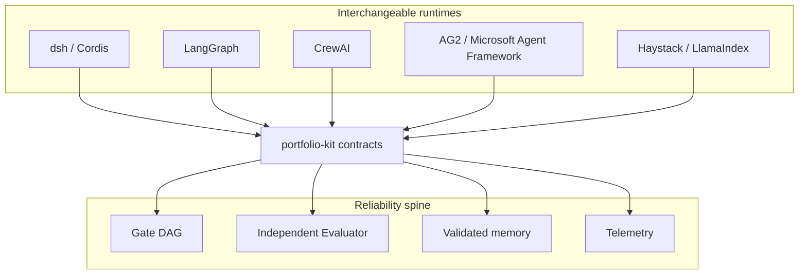

# Architecture

**Contract version:** 0.1.0  
**Source of truth for primitives:** [Meridian](https://github.com/PCSchmidt/meridian)

## Spine vs runtimes

Meridian already implements the reliability properties this family reuses:

- YAML gate DAGs with mechanical `verify` (exit 2 blocks)
- Independent Evaluator (fresh context, adversarial scoring)
- Schema-validated memory (semantic / episodic / corrections)
- Structured telemetry that engineers can grep

Sibling projects do **not** invent a second gate language. They either:

1. **Consume** Meridian (CLI, hooks, or a later MCP server), or
2. **Re-implement the same contracts** inside another runtime (especially Cordis / dsh).

Frameworks are interchangeable *runtimes*. The spine is the contract.

## Project map

| Project | Runtime | What it adds |
|---------|---------|--------------|
| Meridian | Shell hooks + Claude Code / portable verifier | Source of primitives |
| dsh-plugin-honesty-gate | Cordis services + waterfall hooks | Same contracts inside dsh |
| agent-framework-bakeoff | Four runtimes, one task | Comparative evals |
| living-docs-architect | Observer + architect + remediation | Docs as agent-managed state |
| meridian-jspace | Open-weight model + J-lens | Why the Evaluator rejected |
| gate-enforced-rag | Haystack / LlamaIndex | Pre-delivery gate on RAG |
| redteam-blue-gate | Crew / graph in a sandbox | Verified findings only |

## Non-goals

- Replacing Claude Code, Codex, Cursor, or Copilot as a daily editor.
- Re-implementing file editing, terminal control, or sandboxing from scratch.
- Mixing classified or employer program data into any public repo.

## Evolution of Meridian (Phase 9, later)

After this kit is stable:

- Multi-model routing (OpenAI-compatible + local)
- Per-project isolation of memory, gates, and calibration
- MCP / CLI so other agents can call Evaluator and memory
- A **delegate-then-evaluate** tool: hand a scoped task to an external coding agent, then run the independent Evaluator before advancing
